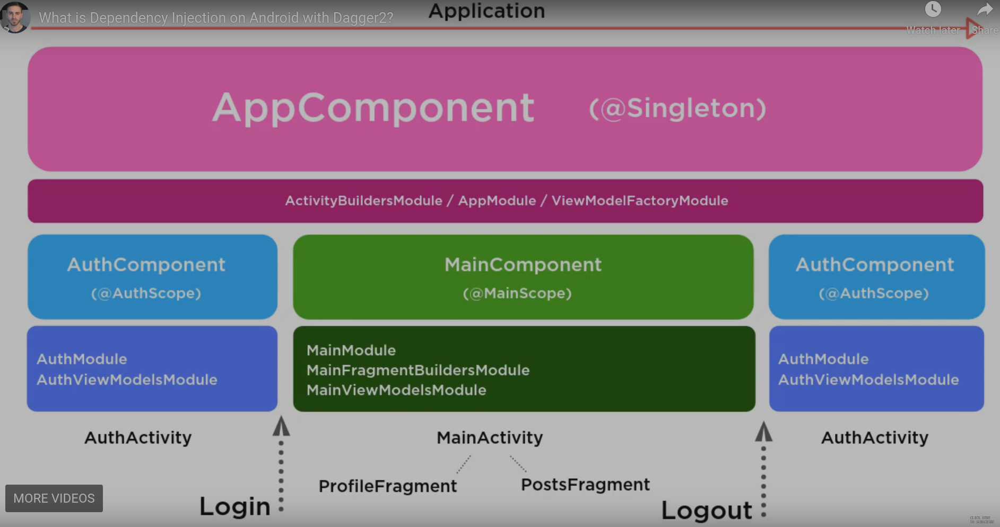
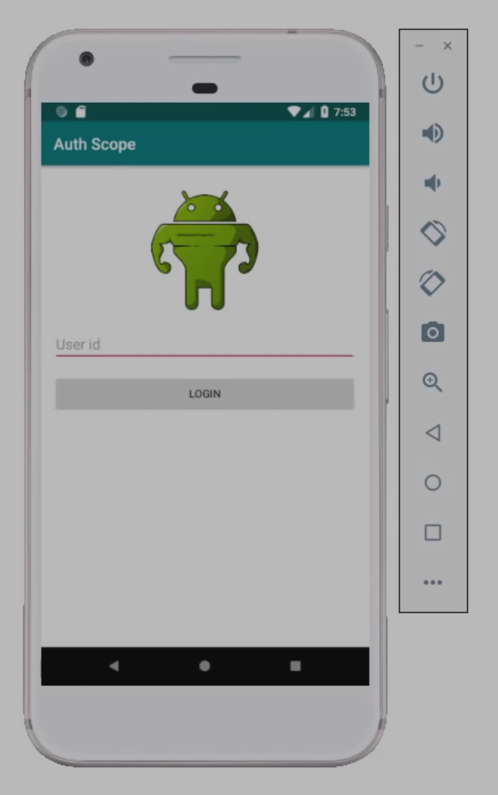

# dagger-notes
Notes of learning Dagger and Dagger-Android

Sources:
  * https://codingwithmitch.com/courses/dagger22-android/what-dagger22/

Source code:
  * https://github.com/mitchtabian/Dagger-Examples

## Dagger Dependencies in an Android Project
```Groovy
dependencies {
    implement 'com.google.dagger:dagger:2.x'
    annotationProcessor 'com.google.dagger:dagger-compiler:2.x'
}
```
If using classes in `dagger.android`:
```Groovy
    implement 'com.google.dagger:dagger-android:2.x'
    implement 'com.google.dagger:dagger-android-support:2.x' // if using support libraries
    annotationProcessor 'com.google.dagger:dagger-android-processor:2.x'
```

## What is Dagger2.2?
***Dagger is essentially a code generator.***

```Java
public class User{
    private int id;
    private String username;
    public User(int id, String username){
        this.id = id;
        this.username = username;
    }
}
```
The integer `id` and string `username` are dependencies of the `User` class; bcuz it depends on them to be created.

Dagger takes this general concept to provide dependencies to higher level of abstraction. This makes your code very **clear**, **concise** and **testable**.

One of the things you can do with dagger is injecting a **Singleton** Pattern for an object.

### Diagrams of the sample app




## Application Component
Creating an Application-level Component class is always required for using Dagger in Android.

For using Dagger we should inherit our `BaseApplication` class from `DaggerApplication`:
```Java
public class BaseApplication extends DaggerApplication {
    \\ This is the function returning the AppComponent
    @Override
    protected AndroidInjector<? extends DaggerApplication> applicationInjector() {
        return DaggerAppComponent.builder().application(this).build();
    }
}
```
We can consider the `BaseApplication` class as the client and the `AppComponent` class as the server.
`AppComponent` is actually an interface extending from `AndroidInjector<BaseApplication>`:
```Java
@Component(
        modules = { // Include some additional dependencies.
                AndroidSupportInjectionModule.class,
        }) // Telling Dagger (code generator): I'm believing this class as a component class
public interface AppComponent extends AndroidInjector<BaseApplication> { // in Android we should extend from AndroidInjector
// Meaning we're injecting BaseApplication class into AppComponent.

    // Overridong the Component.builder() method whose code will be created by Dagger from Builder interface.
    @Component.Builder
    interface Builder{

        // Binds an instace of an object to the component at the time of construction.
        @BindsInstance
        Builder application(Application application);

        AppComponent build();
    }
}

```

In general:
  * Components = Services
  * Activities/Fragments = Clients

You will **ALWAYS** need an **AppComponent** and you will **ALWAYS** need to put it inside your **BaseApplication** class.

## Injecting Activities and @ContributesAndroidInjector
Every Dagger interaction = a client-server interaction in some level.

At veiw-level: Activities and Fragments act as clients; and Components as 
services.

For this, we should first mark activities as potential clients.

**Dagger Module**: A place for dependencies to live to add them to components.

```Java
@Module
public abstract class ActivityBuildersModule {
    @ContributesAndroidInjector //AuthActivity is a potential client that I can inject dependencies into.
    abstract AuthActivity contributeAuthActivity();


    @Provides //Inject this static dependency into AuthActivity.
    static String someString(){
        return "this is a test string";
    }
}


// Should extend from DaggerAppCompatActivity
public class AuthActivity extends DaggerAppCompatActivity {
    private static final String TAG = "AuthActivity";

    @Inject // Property to inject into.
    String someString;

    @Override
    protected void onCreate(Bundle savedInstanceState) {
        super.onCreate(savedInstanceState);
        setContentView(R.layout.activity_auth);

        Log.d(TAG, "onCreate: " + someString);
    }
}
```

You ALWAYS will have to declare your activities inside **ActivityBuildersModule** class.

## Component Modules and static @Provides
```Java
@Component(
        modules = {
                AndroidSupportInjectionModule.class, // Always needed for Application-level AppComponent.
                ...
        })
public interface AppComponent extends AndroidInjector<BaseApplication> {
    ...
}
```

**`AppModule` class**: where we should put all of the application-level dependencies for the project. e.g. Retrofit Instance, Glide instance and *anything that is going to exist and not change for the entire lifetime of the app*.

**`@Provides` annotation**: used to declare a dependency. e.g.
```Java
@Module
public class AppModule {

    @Provides // creates this dependency when this String is injected into an Activity.
    static String someString(){
        return "this is a test string";
    }
}
```
We use `static` for dependencies bcuz documentation recommends; it is more efficient.

a (sub)modulea is unique to the particular component.
  * *AuthModule* -> *AuthComponent*
  * *MainModule* -> *MainComponent*

### Referencing Multiple Dagger Dependencies within a Single Module
It can be a good convention to name `AppModule` class `@Provides` methods as `providesSth(){...}`.

#### Injecting `Glide` into our `AuthActivity`
```Java
    @Provides
    static RequestOptions provideRequestOptions(){
        return RequestOptions
                .placeholderOf(R.drawable.white_background)
                .error(R.drawable.white_background); // If Glide can't load image
    }
```

```Java
    @Provides
    static RequestManager provideGlideInstance(Application application, RequestOptions requestOptions){
        // We also have a RequestOptions object available bcuz of the upper function.
        return Glide.with(application)
                .setDefaultRequestOptions(requestOptions);
    }
```

```Java
public class AuthActivity extends DaggerAppCompatActivity {

    private static final String TAG = "AuthActivity";

    @Inject
    Drawable logo;

    @Inject
    RequestManager requestManager;

    private void setLogo(){
        requestManager
                .load(logo)
                .into((ImageView)findViewById(R.id.login_logo));
    }
}
```

## Scoping, Custom Scopes & Singletons
**Singletons**: you provide instances and they exist as long as the app is alive; But not a good idea to mark every object of your app as Singleton: If app get quite big all of these objects lay around in memory -> a lof of overhead.

**Scoping** is the solution of the *problem of having all objects sitting around in memory* (not needed of course).
  * Singleton is only one scope.
  * You can create a scope to only exist as long as some Activity or Component exists.
  * You can build a *custom scope* and tell objects to become instances under *finite conditions*.

### Singleton Scope with Dagger2

